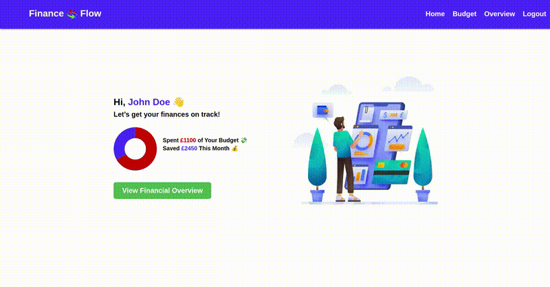
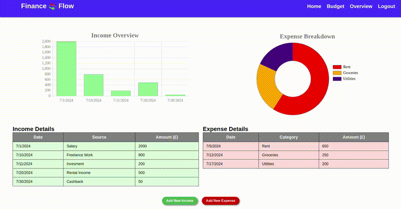
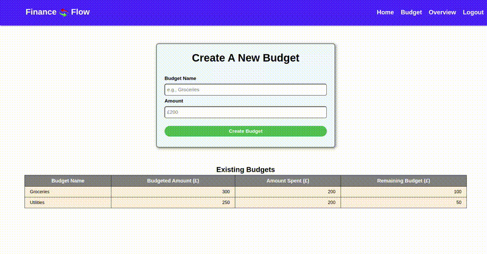

# Project 2: Personal Finance Tracker Application


## Overview

This application helps users manage their finances by tracking income, expenses, and budgets. It provides visual insights through charts and graphs to simplify financial planning and budgeting.

## Table of Contents

- [🎥 Application Demo ](#🎥-application-demo)
- [🚀Installation ](#🚀-installation)
- [🏗️ Usage](#🏗️-usage)
- [⚒️ Technologies Used](#⚒️-technologies-used)
- [🤝 Contributing ](#🤝-contributing)
- [📄 License ](#📄-license)
- [❓ Questions ](#❓-questions)

## 🎥 Application Demo

As you can see in the following animation, a user can view their their financial summary, a break down of their income & expenses, and see if their on track with their budgeting:



The user can add, remove, and update income and expenses. The income & expense is added to the bar and doughnut charts respectively using chart.js and are updated in real-time, as demonstrated in the following animation:



The user can set a budegt goal for the month and see if they are on track. Users can also update and delete a budget as shown in the following animation:



## ⚒️ Technologies Used

#### Backend:

- **Express**: Web framework for Node.js.
- **Sequelize**: ORM for SQL databases.
- **pg**: PostgreSQL client for Node.js.
- **bcrypt**: Password hashing library.
- **dotenv**: Environment variable manager.
- **connect-session-sequelize**: Session store for Sequelize.
- **express-session**: Session middleware for Express.
- **express-handlebars**: Templating engine for Express.

#### Development Tools:

- **nodemon**: Utility that monitors for changes and restarts the server.

## 🚀 Installation

1. Clone the Repository:

```sh
git clone https://github.com/A-MOHAMED14/Personal-Finance-Tracker.git
```

2. Navigate to the Project Directory:

```sh
cd Personal-Finance-Tracker
```

3. Install dependencies:

```sh
npm install
```

4. Set up enviroment variables:

- Create a .env file in the root directory and add your PostgreSQL database credentials:

```sh
DB_NAME=your_database_name
DB_USER=your_postgresql_username
DB_PASSWORD=your_postgresql_password
```

5. Create the database and seed data:

```sh
psql -U <your_postgresql_username> -d <your_database_name> -f db/schema.sql

npm run seed
```

## 🏗️ Usage

To start the application, run the following command:

```sh
npm run start
```

This will sync the Sequelize models to your PostgreSQL database, and will then start the server. The server will be running on http://localhost:3001

## 🤝 Contributing

Contributions are welcome! If you'd like to contribute to this project, please follow these guidelines:

1. Fork the repository.
2. Create a new branch for your feature or bugfix:

```sh
git checkout -b feature/your-feature-name
```

3. Make your changes and commit them with descriptive messages:

```sh
git commit -m "Add new feature: your feature description"
```

4. Push your changes to your forked repository:

```sh
git push origin feature/your-feature-name
```

5. Open a pull request to the main repository, describing your changes in detail.

## 📄 License

This project is licensed under the MIT License. You are free to use, copy, modify, merge, publish, distribute, sublicense, and/or sell copies of the software, provided that the original copyright notice and permission notice are included in all copies or substantial portions of the software. For more details, see the MIT [LICENSE](https://opensource.org/licenses/MIT) file.

## ❓ Questions

If you have any questions about the project, please feel free to contact me directly:

GitHub: <a href="https://github.com/A-MOHAMED14">A-MOHAMED14</a>

Email: <a href="mailto:amin800@hotmail.co.uk">amin800@hotmail.co.uk</a>
